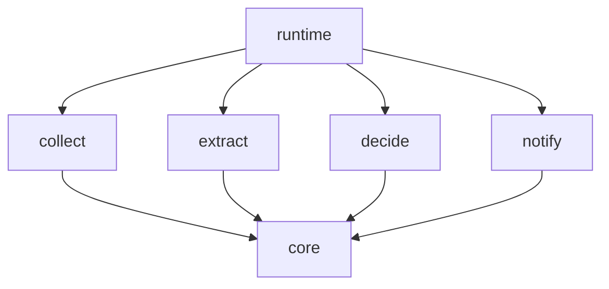
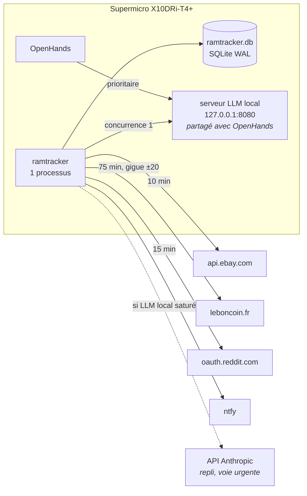
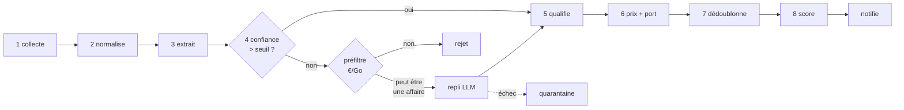

# 01 — Architecture

> Prérequis : [00-PRIMER.md](00-PRIMER.md)

---

## 1. Packages

Six packages sous `src/ramtracker/`. Aucun n'est un framework : chacun a une
responsabilité étroite et un contrat court.

| Package | Responsabilité | Ne contient pas |
|---|---|---|
| `core` | Configuration, journalisation, erreurs, base SQLite, DTO, horloge, hachage, monnaie | toute logique métier |
| `collect` | Un collecteur concret par source ; produit des `RawListing` | interprétation du contenu |
| `extract` | Transforme un `RawListing` en `MemorySpec` ; qualifie contre `compat.yaml` | accès réseau (sauf `extract.llm`) |
| `decide` | Dédoublonnage, indice de marché, double barrière, politique d'enchères | envoi de notification |
| `notify` | Rendu des gabarits, envoi, limitation de débit | décision d'alerter |
| `runtime` | Ordonnanceur, câblage du pipeline, chien de garde, disjoncteur, CLI | logique métier |

La séparation `decide` / `notify` n'est pas cosmétique : `decide` décide **s'il faut**
alerter et avec quelle urgence, `notify` décide **comment** le message est rendu et
si le quota autorise l'envoi. Les deux échouent pour des raisons différentes.

---

## 2. Graphe de dépendances

Aucune dépendance inverse, aucune dépendance latérale. `core` ne dépend de rien.

---

## 3. Contraintes d'import (vérifiées par `import-linter`)

| # | Contrat |
|---|---|
| **D1** | `core` n'importe aucun autre package de `ramtracker`. |
| **D2** | `collect`, `extract`, `decide` et `notify` n'importent que `core`. |
| **D3** | `extract` n'importe pas `collect` — il **reçoit** des `RawListing` en paramètre. |
| **D4** | `decide` n'importe ni `collect` ni `notify`. |
| **D5** | `runtime` est le **seul** package autorisé à importer les quatre packages métier. |
| **D6** | Seul `collect` émet des requêtes réseau vers une place de marché. |
| **D7** | Seul `notify` émet des requêtes réseau vers un service de notification. |
| **D8** | `extract`, **hors** le sous-module `extract.llm`, ne fait **aucune I/O** : ni réseau, ni fichier, ni base, ni horloge système. |

**D8 est le contrat le plus important du projet.** C'est lui qui permet à la suite de
tests du parseur de tourner en une seconde, sans réseau, de façon déterministe — et
donc d'itérer sur l'extraction pendant que Leboncoin est bloqué par DataDome. Toute
fonction de `extract` qui a besoin de l'heure la reçoit en paramètre.

`extract.llm` est l'exception explicite, isolée dans son propre module précisément
pour que le reste du package reste pur.

---

## 4. Topologie runtime

Un seul processus, un seul fichier de base. Aucun service à superviser en dehors de
ce qui tourne déjà sur la machine.

---

## 5. Points d'entrée externes

| Cible | Protocole | Authentification | Quota | Marqueur |
|---|---|---|---|---|
| `api.ebay.com/buy/browse/v1` | HTTPS JSON | OAuth `client_credentials`, jeton 2 h | 5 000 appels/jour | `[À CONFIRMER]` id de catégorie |
| `www.leboncoin.fr/recherche` | HTTPS HTML | aucune | aucun officiel — auto-limité à ~24 req/jour | `[À CONFIRMER]` chemin JSON |
| `oauth.reddit.com/r/…/new` | HTTPS JSON | OAuth application « script » | 100 req/min | — |
| serveur LLM local | HTTP, compatible OpenAI | aucune (boucle locale) | concurrence 1 côté RamTracker | `[À CONFIRMER]` forme du `response_format` |
| ntfy | HTTPS POST | jeton dans l'URL du sujet | — | `[À CONFIRMER]` noms d'en-têtes |
| API Anthropic | HTTPS | clé API | — | repli uniquement |

Aucun port n'est ouvert en écoute par le service, sauf le point d'entrée HTTP des
boutons d'action introduit en WP09, qui écoute sur `127.0.0.1` **uniquement**.

---

## 6. Le pipeline

Huit étages. Chacun est une fonction d'un type vers un autre, testable isolément.

Deux points de persistance : la charge utile brute est écrite après l'étage 2, la
spec après l'étage 5. Voir [04-DATA-MODEL.md](04-DATA-MODEL.md).

---

## 7. Ce qui casse en premier

Classement par probabilité, à garder en tête en concevant :

1. **Leboncoin change son schéma JSON** → zéro annonce, aucune erreur levée.
   Parade : chien de garde inversé (§4 de [07-ERRORS-AND-LOGGING.md](07-ERRORS-AND-LOGGING.md)).
2. **DataDome bloque l'IP** → défi HTTP, détectable. Parade : disjoncteur + repli exponentiel.
3. **Le jeton eBay expire** ou le quota est atteint → 401/429, détectable.
4. **Le serveur LLM est saturé par OpenHands** → timeout. Parade : deux voies + repli distant.
5. **Un vendeur écrit un titre inédit** → confiance basse, quarantaine. Sans gravité,
   mais à relire mensuellement pour enrichir le corpus doré.
