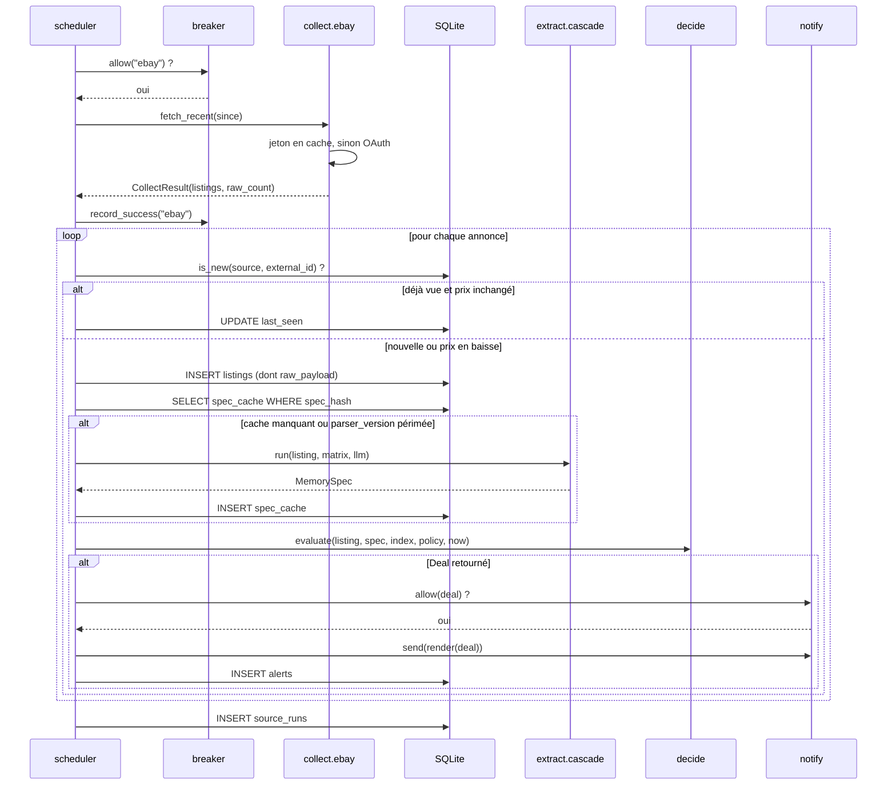
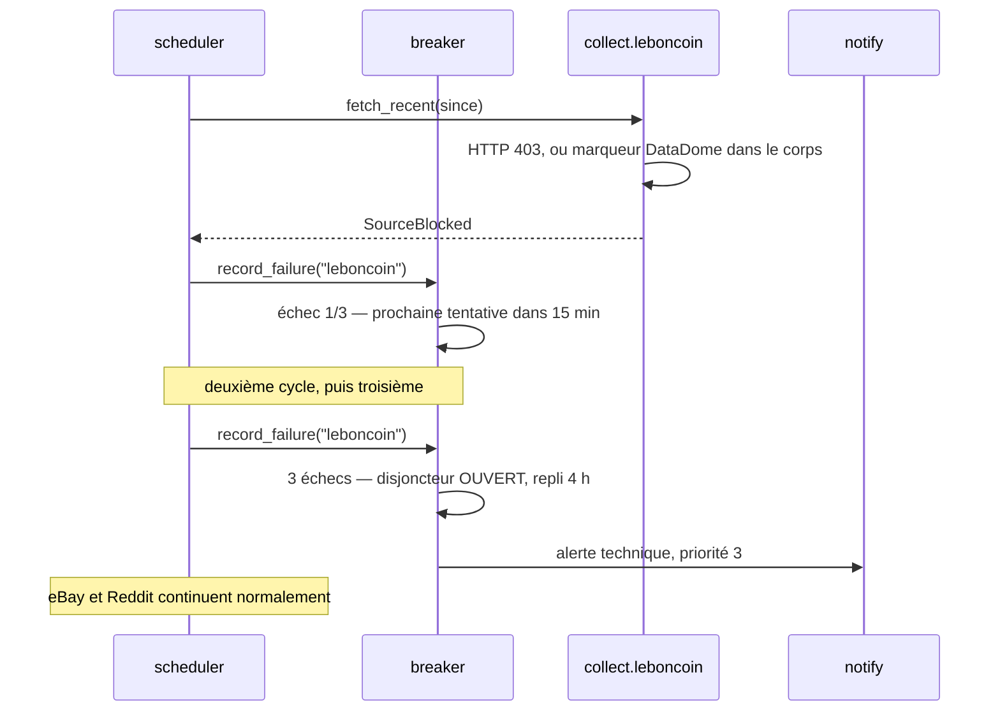
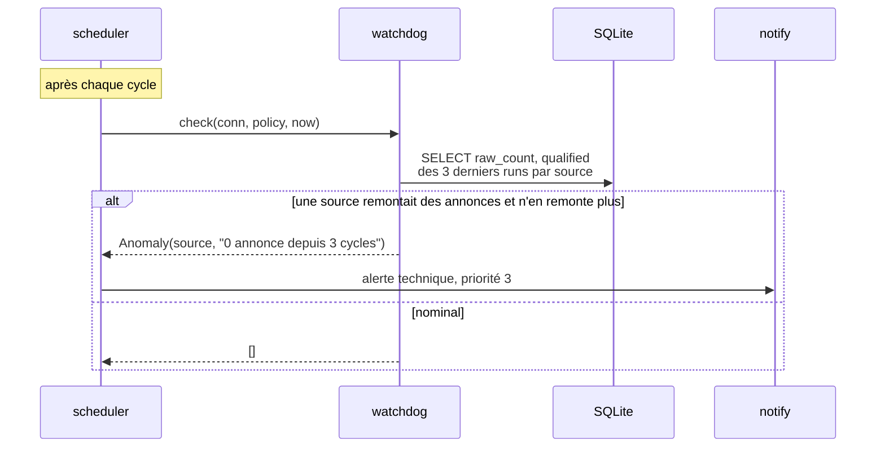

# 05 — Séquences

> Prérequis : [01-ARCHITECTURE.md](01-ARCHITECTURE.md) · [03-INTERFACES.md](03-INTERFACES.md)

Quatre parcours bout-en-bout. Ils fixent l'ordre des appels et les points de
persistance ; les signatures sont dans `03`.

---

## 1. Cycle nominal — d'eBay à la notification



Le `SELECT spec_cache` **avant** l'appel à la cascade est ce qui fait tout le travail
d'économie : un repost, un doublon inter-sources ou une simple republication ne
déclenchent aucune extraction.

---

## 2. Annonce ambiguë — préfiltre puis file LLM (WP07)

```mermaid
sequenceDiagram
    participant X as extract.cascade
    participant P as extract.prefilter
    participant Q as runtime.llm_queue
    participant L as serveur LLM local
    participant A as API distante

    X->>X: partnum.decode → None
    X->>X: grammar.parse → confiance 0.55
    X->>X: coherence.check → confiance 0.45
    Note over X: sous le seuil : ne pas deviner
    X->>P: best_case_eur_per_gb(listing)
    alt meilleur cas > barrière absolue
        P-->>X: rejet "meilleur_cas_hors_seuil"
        Note over P,X: aucun appel LLM — zéro faux négatif par construction
    else peut être une affaire
        P-->>X: 1,80 €/Go
        X->>Q: enqueue(spec_hash, lane, best_case)
        alt voie urgente
            Q->>L: extract_batch, timeout court
            alt serveur occupé par OpenHands
                L-->>Q: timeout
                Q->>A: repli distant
                A-->>Q: MemorySpec
            else
                L-->>Q: MemorySpec
            end
        else voie différée
            Note over Q: minuterie 30 min ; tour sauté si le serveur est occupé
            Q->>L: extract_batch
            L-->>Q: MemorySpec
        end
    end
```

La voie urgente n'est empruntée que lorsque la borne optimiste est très en dessous de
la barrière — quelques fois par semaine. C'est ce qui rend acceptable d'accepter la
contention avec OpenHands dans ce cas précis.

---

## 3. Blocage anti-bot et disjoncteur



Le disjoncteur est **par source**. Une seule règle à ne jamais enfreindre : aucune
nouvelle tentative avant la fenêtre suivante. Une boucle de retry serrée transforme
un blocage temporaire en blocage durable.

---

## 4. Le chien de garde inversé



C'est l'alerte la plus importante du système : la seule qui signale que **le système
ment**. Sans elle, un changement de schéma chez Leboncoin passe pour un marché calme
et peut durer des mois.
