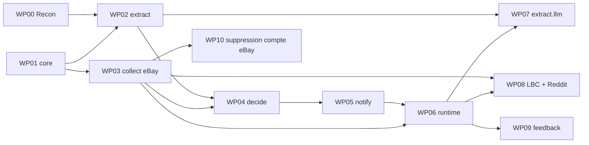

# Blueprint d'implémentation — index

Ce dossier contient la **spécification d'implémentation détaillée** de RamTracker.
Il est écrit pour être lu par des agents de code **sans contexte préalable**.

> **Ce qu'on construit**
>
> **Le produit** = un agent de veille qui traque la DDR4 ECC sous-évaluée sur le
> marché de l'occasion, la qualifie au €/Go et notifie quand une annonce sort
> réellement du marché.
>
> **La cible** = un **Supermicro X10DRi-T4+**, 16 slots DIMM, DDR4 RDIMM/LRDIMM
> 2133 ou 2400. Voir [10-HARDWARE-TARGET.md](10-HARDWARE-TARGET.md).

`../docs/blueprint.html` est le document narratif : il explique **pourquoi** ces
décisions ont été prises (analyse de marché, arbitrages, chiffrages). **Il n'est pas
nécessaire de le lire pour implémenter.** Tout ce qui est nécessaire est ici, et en
cas de divergence **ce dossier fait foi**.

---

## Règle de lecture

**Tout agent lit `00-PRIMER.md` en premier.** Ensuite, uniquement les fichiers
listés en tête de son work package.

---

## Documents transverses

| Fichier | Contenu | Lire si… |
|---|---|---|
| [00-PRIMER.md](00-PRIMER.md) | Contexte, principes, décisions verrouillées, interdits | **toujours** |
| [01-ARCHITECTURE.md](01-ARCHITECTURE.md) | Packages, frontières, contraintes d'import, topologie runtime | vous touchez à plusieurs packages |
| [02-REPOSITORY-TREE.md](02-REPOSITORY-TREE.md) | Arborescence complète + responsabilité fichier par fichier | vous créez des fichiers |
| [03-INTERFACES.md](03-INTERFACES.md) | Contrats inter-packages (signatures, aucun corps) | vous implémentez un package |
| [04-DATA-MODEL.md](04-DATA-MODEL.md) | Schéma SQLite, index, migrations, rétention | vous touchez la base |
| [05-SEQUENCES.md](05-SEQUENCES.md) | Diagrammes de séquence bout-en-bout | vous câblez deux composants |
| [06-CONFIG.md](06-CONFIG.md) | Référence de configuration, `.env`, fichiers YAML | vous ajoutez un paramètre |
| [07-ERRORS-AND-LOGGING.md](07-ERRORS-AND-LOGGING.md) | Taxonomie d'erreurs, contrat de logging, métriques de run | vous levez/attrapez une erreur |
| [08-TESTING.md](08-TESTING.md) | Corpus doré, invariants, fixtures, CI | **toujours avant de coder** |
| [09-CONVENTIONS.md](09-CONVENTIONS.md) | Conventions de code, unités, nommage, Definition of Done | **toujours avant de coder** |
| [10-HARDWARE-TARGET.md](10-HARDWARE-TARGET.md) | **La cible** : X10DRi-T4+, matrice de compatibilité, décodeur de références, ancrages marché | vous touchez au filtre de qualification |

---

## Work packages

Chaque WP est **autonome** : il rappelle son contexte, ses dépendances, ses
livrables et ses critères d'acceptation. Ils sont ordonnés par dépendance.

| WP | Titre | Dépend de | Parallélisable avec |
|---|---|---|---|
| [WP00](wp/WP00-reconnaissance.md) | Reconnaissance & référentiel — `compat.yaml`, corpus doré, spikes, clés | — | WP01 |
| [WP01](wp/WP01-core.md) | `core` — noyau partagé (config, logging, erreurs, base, modèles) | — | WP00 |
| [WP02](wp/WP02-extract.md) | `extract` — parseur déterministe (références, grammaire, cohérence) | WP00, WP01 | WP03 |
| [WP03](wp/WP03-collect-ebay.md) | `collect` — interface `Collector` + collecteur eBay | WP01 | WP02 |
| [WP04](wp/WP04-decide.md) | `decide` — dédoublonnage, indice de marché, seuils, enchères | WP02, WP03 | — |
| [WP05](wp/WP05-notify.md) | `notify` — ntfy, gabarits, anti-spam | WP04 | — |
| [WP06](wp/WP06-runtime.md) | `runtime` — ordonnanceur, cadence par source, chien de garde, déploiement | WP03, WP05 | — |
| [WP07](wp/WP07-extract-llm.md) | `extract.llm` — préfiltre €/Go admissible + repli LLM local | WP02 · WP06 pour la voie différée | WP08 |
| [WP08](wp/WP08-collect-lbc-reddit.md) | Collecteurs Leboncoin (DataDome) & Reddit | WP03, WP06 | WP07 |
| [WP09](wp/WP09-feedback.md) | Boucle d'amélioration — retour d'usage, rapport, rejeu du parseur | WP06 | — |
| [WP10](wp/WP10-ebay-account-deletion.md) | Point d'entrée de suppression de compte eBay — conformité RGPD/CCPA | WP03 | WP07 · WP08 · WP09 |

---

## Ordre d'exécution recommandé

**Chemin critique minimal pour recevoir une vraie notification** :
`WP00 → WP01 → WP02 → WP03 → WP04 → WP05`.

À ce stade le système fonctionne avec **eBay comme unique source et sans LLM**.
WP06 le rend autonome. WP07 (LLM), WP08 (Leboncoin, Reddit) et WP09 (boucle
d'amélioration) améliorent un système qui marche déjà — c'est délibéré : déboguer
l'anti-bot de Leboncoin avant d'avoir la moindre notification est le meilleur moyen
d'abandonner le projet.

---

## Ce que ce blueprint ne fait PAS

- Il ne contient **aucune implémentation**. Uniquement des signatures, schémas,
  contrats et diagrammes.
- Il ne fige pas les détails d'API tierces (eBay Browse, structure JSON de
  Leboncoin, en-têtes ntfy, endpoint du serveur LLM local). Les points marqués
  `[À CONFIRMER]` doivent être vérifiés dans la documentation officielle **au moment
  de l'implémentation**, jamais devinés. WP00 existe précisément pour cela.
- Il ne planifie pas le **peuplement** des slots mémoire. Le système qualifie des
  annonces ; l'appairage RDIMM/LRDIMM et l'agencement des rangs se décident au
  montage, pas à l'achat.

---

## Correspondance avec le document narratif

`../docs/blueprint.html` découpe le travail en phases `P0`–`P7`. Ce dossier le
redécoupe en work packages, qui sont plus fins et alignés sur les packages Python.

| Phase narrative | Work packages |
|---|---|
| P0 — Cadrage & reconnaissance | WP00 |
| P1 — Socle | WP01 |
| P2 — Extraction | WP02, et WP07 pour le repli LLM |
| P3 — Collecteurs | WP03 (eBay), WP08 (Leboncoin, Reddit) |
| P4 — Décision | WP04 |
| P5 — Notification | WP05 |
| P6 — Exploitation | WP06, WP10 (conformité eBay) |
| P7 — Boucle d'amélioration | WP09 |
